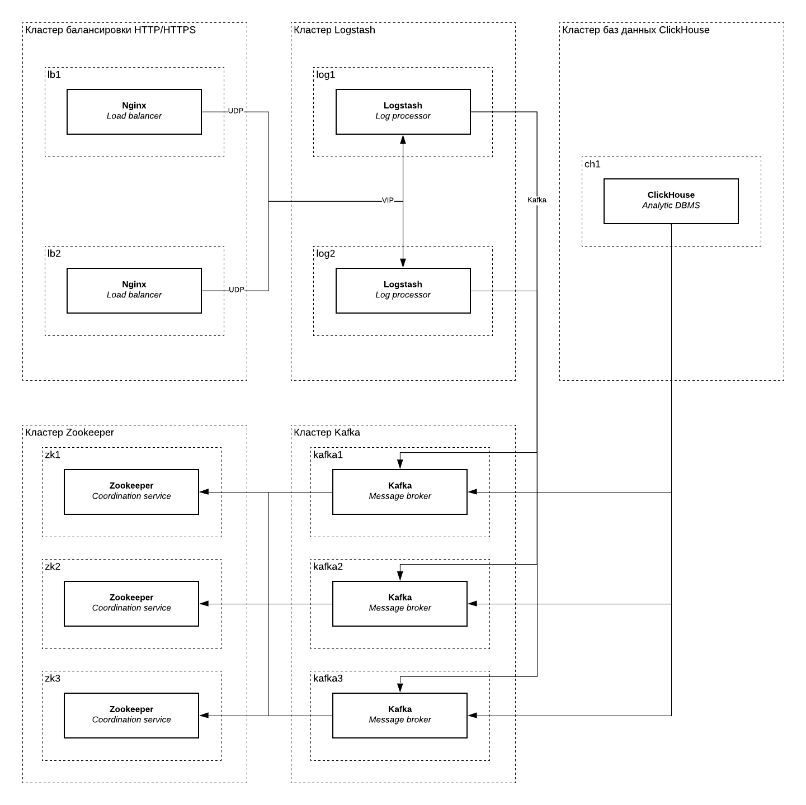

<lead>Опыт разработки, настройки и эксплуатации системы сбора access-логов Nginx. Агрегация, анализ и визуализация метрик ClickHouse.</lead>

<br />В больших компаниях вопрос обработки логов стоит остро: записей много и по ним часто ищут. Главная трудность работы с традиционными текстовыми журналами состоит в  фильтрации, группировке и сортировке. Несмотря на то, что такие файлы легко читать человеку, компьютеру для анализа потребуется токенизировать строки (часто с использованием регулярных выражений), сравнивая подстроки с результатом построчно.



В условиях отсутствия индекса по таким записям, работа с текстом требовательна ресурсам как для поиска, так и для агрегации, а потому неэффективна. Кроме того, при составлении регулярных выражения легко допустить ошибку и исказить результаты. Эти недостатки проявляются ещё сильнее в нагруженных проектах с большим количеством серверов.

Решением этих проблем является централизованная система по доставке и обработке логов. В зависимости от целей, преследуемых командой эксплуатации, реализация может быть разной.

К примеру, для поиска одного события в гуще неструктурированных логов больше подойдут документо-ориентированные хранилища, а для агрегации числовых метрик — колоночные. В любом случае, запуск такой системы в компании открывает новые возможности по аналитике и мониторингу состояния проектов.

В этой статье рассмотрим пример создания системы сбора структурированных логов из Nginx в ClickHouse с использованием Logstash и Kafka. Система призвана облегчить оценку качества сервисов и сократить время реакции на скрытые проблемы при эксплуатации.

### Архитектура

Ниже представлена архитектурная схема кластера по сбору и доставке логов. На схеме отмечены следующие группы серверов: кластер балансировки HTTP/HTTPS (`lb`), кластер Logstash (`log`), кластер Zookeeper (`zk`), кластер Kafka (`kafka`) и кластер баз данных ClickHouse (`ch`).

{{}}

Nginx пересылает сообщения в формате JSON по протоколу syslog (UDP) в кластер Logstash по VIP-адресу. Доступность этого адреса обеспечивается VRRP (KeepAlived), назначая следующему узлу IP-адрес в случае недоступности сервера или процесса Logstash. При необходимости, Logstash-кластер можно горизонтально масштабировать, установив перед ними UDP-балансировщик.

Logstash обрабатывает сообщения и складывает результат в формате JSON (разделённые `\n`) в топик Kafka. Для надёжности топик Kafka разбит на несколько партиций с фактором репликации 2, что позволяет Kafka обслуживать топик в случае недоступности одного из трёх брокеров.

Zookeeper на схеме требуется Kafka-кластеру. Он также зарезервирован и продолжит работу в случае недоступности одного сервера.

Один сервер Clickhouse потребляет топик Kafka через работу Kafka-таблиц. При необходимости, эту группу серверов можно зарезервировать, используя [Replicated](https://clickhouse.yandex/docs/en/operations/table_engines/replication/)-движки для таблиц. В этом случае для синхронизации также потребуется Zookeeper.

Резервирование каждого из узлов кластера означает возможность бесшовного обслуживания серверов (обновление, аварийное восстановление) в случае частичной деградации. Некоторые группы могут быть выведены из строя полностью. 

Так, например, кластер ClickHouse может быть остановлен на время, равное `retention.ms` топика Kafka (если не будет достигнуто `retention.bytes`). Сообщения продолжат копиться в очереди и будут вычитаны после восстановления работы. Если для завершения работ нужно больше времени, то достаточно увеличить `retention.ms` для топика, а после вернуть ограничение обратно.

Кроме того, если одновременно с записью в syslog, вести и текстовые журналы в едином формате, то с помощью `logger(1)` можно самостоятельно загрузить лог в ClickHouse через Logstash.

### Конфигурация

Опишите новый формат логирования для пересылки в Logstash. JSON прекрасно подходит: легко читается людьми и не требует токенизации в Logstash, экономя ресурсы. Обратите внимание, что числовые значения следует передавать без кавычек, а строковые — в кавычках. Немаловажно и то, что некоторые переменные, хоть и принимают числовое значение, иногда могут быть пустыми.

Как, например, в случае с `$upstream_response_time`: когда в конфигурации Nginx нет `upstream` (ответ отдаётся сервером напрямую), то переменная будет пустой строкой. В этом случае практичнее передавать её как строку, а уже на стороне ClickHouse преобразовывать в число нужного типа с помощью функций `toFloat32OrZero()` или `toFloat64OrZero()`.

> Подробнее о [функциях преобразованиях типов](https://clickhouse-docs.readthedocs.io/en/latest/functions/type_conversion_functions.html) в документации ClickHouse.

Или же можно передавать в лог не её, а map-переменную:

```
map $upstream_response_time $response_time {
    "" 0.0;
    default $upstream_response_time;
}
```

В новых версиях Nginx при объявлении формата логирования используйте опцию `escape=json` или преобразуйте hexdecimal в Unicode на уровне Logstash. Или же такие запросы можно игнорировать, пренебрегая их ценностью.

``` nginx
   log_format json_encoded escape=json
   '{'
      '"request_id":"$request_id",'
      '"time_iso8601":"$time_iso8601",'

      '"remote_user":"$remote_user",'
      '"remote_addr":"$remote_addr",'

      '"scheme":"$scheme",'
      '"host":"$host",'
      '"server_addr":"$server_addr",'

      '"request_method":"$request_method",'
      '"request_uri":"$request_uri",'
      '"request_length":$request_length,'
      '"request_time":$request_time,'

      '"status": $status,'
      '"body_bytes_sent":$body_bytes_sent,'

      '"upstream_addr":"$upstream_addr",'
      '"upstream_response_time":"$upstream_response_time",'

      '"http_referrer":"$http_referer",'
      '"http_user_agent":"$http_user_agent",'
      '"http_x_forwarded_for":"$http_x_forwarded_for"'
   '}';
```

Сконфигурируйте Nginx для пересылки журналов в syslog-сервер на базе Logstash по UDP-порту 60514. К сожалению, Nginx не умеет отправлять лог в syslog по TCP. В качестве обходных путей можно использовать `socat(1)` или же записывать журнал в локальный syslog, перенаправляя сообщения по TCP с использованием RELP. Или же, если не беспокоит сохранность при доставке, продолжать использовать UDP в роли транспорта.

```
access_log syslog:server=syslog.example.tld:60514,tag=nginx json_encoded;
```

Примените изменения.

```
[sudo] systemctl reload nginx
```

Добавьте репозиторий Logstash.

```
[logstash-7.x]
name=Elastic repository for 7.x packages
baseurl=https://artifacts.elastic.co/packages/7.x/yum
gpgcheck=1
gpgkey=https://artifacts.elastic.co/GPG-KEY-elasticsearch
enabled=1
autorefresh=1
type=rpm-md
```

Импортируйте GPG-ключ.

```
[sudo] rpm --import https://artifacts.elastic.co/GPG-KEY-elasticsearch
```

Установите Logstash.

```
[sudo] yum -y install logstash
[sudo] systemctl enable logstash
```

Опишите пайплайн обработки access-логов в Logstash. Обратите внимание на то, что в поле `time_iso8601` ожидается дата в формате ISO 8601 (переменная `$time_iso8601`). Если вам не требуется извлекать дату из сообщения, а использовать метку времени при её получении в syslog, то удалите блок `date`.

ClickHouse хранит данные с типом `DateTime` как UNIX timestamp с секундной точностью. Выход есть: хранить миллисекунды и наносекунды в отдельной колонке с типом `UInt16` или же хранить дату в одной колонке с типом `UInt64`. Для обработки access-лога секундной точности достаточно, а потому колонку практичнее представлять с типом `DateTime`.

ClickHouse не понимает время Nginx из переменных `$time_local` и `$time_iso8601`. Для преобразования строки в `DateTime`, следует использовать функцию `toDateTime()`, принимающую дату в формате `YYYY-MM-DD hh:mm:ss`, в то время как Nginx логирует дату с временной зоной вида `YYYY-MM-DDThh:mm:ss±hh:mm`. В этом случае мы намеренно преобразуем дату из одного формата в другой с преобразованием таймзоны в Logstash.

``` text
input {
  syslog {
    port => 60514
  }
}

filter {
  json {
    source => "message"
    remove_field => [ "message" ]
  }

  date {
    match => [ "time_iso8601", "ISO8601" ]
    locale => "en"
    timezone => "Europe/Moscow"
    target => "timestamp"
  }

  ruby {
    code => "event.set('timestamp', Time.at(event.get('timestamp').to_i).strftime('%Y-%m-%d %H:%M:%S'))"
  }

  mutate {
    remove_field => [ "@timestamp", 
                      "@version", 
                      "time_iso8601", 
                      "priority", 
                      "facility", 
                      "facility_label", 
                      "program", 
                      "severity", 
                      "severity_label"
    ]
  }
}

output {
  kafka {
    id => "nginx-access-logs"
    acks => "all"
    bootstrap_servers => "kafka1.example.tld:9092,kafka2.example.tld:9092,kafka3.example.tld:9092"
    security_protocol => "PLAINTEXT"
    client_id => "nginx-access-logs-producer"
    compression_type => "snappy"
    topic_id => "nginx-access-logs"
    codec => json_lines
  }
}
```

К сожалению, в Logstash нет стандартного фильтра, выполняющего форматирование дат, потому приходится использовать ruby-фильтр:

``` ruby
ruby {
  code => "event.set('timestamp', Time.at(event.get('timestamp').to_i).strftime('%Y-%m-%d %H:%M:%S'))"
}
```

Ещё некоторые клиенты отправляют в заголовке User-Agent hexdecimal escape-последовательности. Это создаёт проблему при передаче этого заголовка в поле JSON, ведь стандарт [ECMA-404 JSON Data Interchange Syntax](https://www.ecma-international.org/publications/files/ECMA-ST/ECMA-404.pdf) обязывает в этих случаях использовать UTF-16. 

``` text
Mozilla/5.0 (Linux; Android 8.1; Xperia\xA0\XA2 Ultra Build/LMY47I) AppleWebKit/537.36 (KHTML, like Gecko) Version/4.0 Chrome/39.0.0.0 Mobile Safari/537.36
```

Будьте готовы к тому, что часть сообщений вы будете терять из-за некорректных данных, передаваемых клиентами. В зависимости от характера трафика, процент потерь может варьироваться: в моём случае, это 1 запрос на 130 миллионов. На количественные показатели это практически не влияет, а потому в этом случае такими потерями можно пренебречь.

Примените изменения и добавьте сервис в автозагрузку.

``` shell
sudo systemctl restart logstash
sudo systemctl enable logstash
```

Создайте новый топик для Nginx-логов. Учитывайте размер кластера Clickhouse и фактор репликации для надёжного хранения логов и обеспечения отказоустойчивости. Грамотно оцените время хранения записей: заложите время недоступности Clickhouse в периоды обслуживания или аварий (например, 4 часа). 

В период вывода ClickHouse из эксплуатации, можно увеличить `retention.ms`, обеспечив хранение сообщений в топике до момента, когда ClickHouse вновь начнёт вычитывать сообщения из него.

``` shell
kafka-topics.sh --zookeeper zk1.example.tld,zk2.example.tld,zk3.example.tld:2181/kafka \
                               --create \
                               --config retention.ms=$((4 * 60 * 60 * 1000)) \
                               --partitions 1 \
                               --replication-factor 1 \
                               --topic nginx-access-logs
```

Подключитесь к серверу ClickHouse и создайте новую базу данных для метрик.

``` sql
CREATE DATABASE nginx
```

Создайте таблицу для перекладывания данных в ClickHouse. При необходимости, добавьте новые индексы для улучшения производительности выборок. Чтобы хранить метод в ClickHouse как `Enum8`, требуется перечислить все методы. 

Их больше, чем кажется: помимо списка поддерживаемых методов в Nginx, есть и те, о которых вы могли даже не слышать. Полный перечень HTTP-методов есть [в реестре IANA](https://www.iana.org/assignments/http-methods/http-methods.xhtml). Или же хранить методы не числами, а строками, чтобы точно ничего не потерять.

``` sql
CREATE TABLE nginx.access_logs (
  `request_id` String,
  `timestamp` DateTime,
  `remote_user` String,
  `remote_addr` String,
  `scheme` Enum8('unknown' = 0, 'http' = 1, 'https' = 2),
  `host` String,
  `server_addr` String,
  `request_method` Enum8('UNKNOWN' = 0, 'ACL' = 1, 'BASELINE-CONTROL' = 2, 'BIND' = 3, 'CHECKIN' = 4, 'CHECKOUT' = 5, 'CONNECT' = 6, 'COPY' = 7, 'DELETE' = 8, 'GET' = 9, 'HEAD' = 10, 'LABEL' = 11, 'LINK' = 12, 'LOCK' = 13, 'MERGE' = 14, 'MKACTIVITY' = 15, 'MKCALENDAR' = 16, 'MKCOL' = 17, 'MKREDIRECTREF' = 18, 'MKWORKSPACE' = 19, 'MOVE' = 20, 'OPTIONS' = 21, 'ORDERPATCH' = 22, 'PATCH' = 23, 'POST' = 24, 'PRI' = 25, 'PROPFIND' = 26, 'PROPPATCH' = 27, 'PUT' = 28, 'REBIND' = 29, 'REPORT' = 30, 'SEARCH' = 31, 'TRACE' = 32, 'UNBIND' = 33, 'UNCHECKOUT' = 34, 'UNLINK' = 35, 'UNLOCK' = 36, 'UPDATE' = 37, 'UPDATEREDIRECTREF' = 38, 'VERSION-CONTROL' = 39),
  `request_uri` String,
  `request_length` UInt32,
  `request_time` Float64,
  `status` UInt16,
  `body_bytes_sent` UInt32,
  `upstream_addr` String,
  `upstream_response_time` Float64,
  `http_referrer` String,
  `http_user_agent` String,
  `http_x_forwarded_for` String
) ENGINE = MergeTree() PARTITION BY toDate(timestamp)
ORDER BY
  (timestamp, host) SETTINGS index_granularity = 8192
```

Создайте таблицу для агрегированных данных.

``` sql
 CREATE TABLE nginx.access_logs_requests (
  timestamp DateTime,
  host String,
  status UInt16,
  requests UInt32,
  upstream_response_time_mean Float64,
  upstream_response_time_p90 Float64,
  upstream_response_time_p95 Float64,
  upstream_response_time_p99 Float64
) ENGINE = SummingMergeTree() PARTITION BY toDate(timestamp)
ORDER BY
  (timestamp, host, status) SETTINGS index_granularity = 8192
```

Заведите Kafka-таблицу в ClickHouse для чтения JSON из топика. Скорректируйте адреса брокеров, имя топика, название консьюмер-группы и числа консумеров для потребления данных. Учитывайте размер кластера при конфигурации.

``` sql
CREATE TABLE nginx.`.access_logs_kafka` (
  `request_id` String,
  `timestamp` DateTime,
  `remote_user` String,
  `remote_addr` String,
  `scheme` String,
  `host` String,
  `server_addr` String,
  `request_method` String,
  `request_uri` String,
  `request_length` UInt32,
  `request_time` Float64,
  `status` UInt16,
  `body_bytes_sent` UInt32,
  `upstream_addr` String,
  `upstream_response_time` String,
  `http_referrer` String,
  `http_user_agent` String,
  `http_x_forwarded_for` String,
) ENGINE = Kafka SETTINGS kafka_broker_list = 'kafka1.example.tld:9092,kafka2.example.tld:9092,kafka3.example.tld:9092',
kafka_topic_list = 'nginx-access-logs',
kafka_group_name = 'nginx-access-logs-clickhouse-consumer',
kafka_format = 'JSONEachRow',
kafka_row_delimiter = '\n',
kafka_schema = '',
kafka_num_consumers = 1,
kafka_skip_broken_messages = 1
```

Создайте материализованное представление с преобразованием данных из Kafka в типы ClickHouse. Обратите на то, как данные преобразуются в нужные типы. В случае, если ClickHouse не сможет преобразовать типы, то запишет об этом в лог. Ошибочные сообщения не попадут в базу данных.

``` sql
  CREATE MATERIALIZED VIEW nginx.`.mv_access_logs` TO nginx.access_logs (
  `request_id` String,
  `timestamp` DateTime,
  `remote_user` String,
  `remote_addr` String,
  `scheme` Enum8('unknown' = 0, 'http' = 1, 'https' = 2),
  `host` String,
  `server_addr` String,
  `request_method` Enum8('UNKNOWN' = 0, 'ACL' = 1, 'BASELINE-CONTROL' = 2, 'BIND' = 3, 'CHECKIN' = 4, 'CHECKOUT' = 5, 'CONNECT' = 6, 'COPY' = 7, 'DELETE' = 8, 'GET' = 9, 'HEAD' = 10, 'LABEL' = 11, 'LINK' = 12, 'LOCK' = 13, 'MERGE' = 14, 'MKACTIVITY' = 15, 'MKCALENDAR' = 16, 'MKCOL' = 17, 'MKREDIRECTREF' = 18, 'MKWORKSPACE' = 19, 'MOVE' = 20, 'OPTIONS' = 21, 'ORDERPATCH' = 22, 'PATCH' = 23, 'POST' = 24, 'PRI' = 25, 'PROPFIND' = 26, 'PROPPATCH' = 27, 'PUT' = 28, 'REBIND' = 29, 'REPORT' = 30, 'SEARCH' = 31, 'TRACE' = 32, 'UNBIND' = 33, 'UNCHECKOUT' = 34, 'UNLINK' = 35, 'UNLOCK' = 36, 'UPDATE' = 37, 'UPDATEREDIRECTREF' = 38, 'VERSION-CONTROL' = 39),
  `request_uri` String,
  `request_length` UInt32,
  `request_time` Float64,
  `status` UInt16,
  `body_bytes_sent` UInt32,
  `upstream_addr` String,
  `upstream_response_time` Float64,
  `http_referrer` String,
  `http_user_agent` String,
  `http_x_forwarded_for` String,
) AS
SELECT
  request_id,
  timestamp,
  remote_user,
  remote_addr,
  CAST(
    if(scheme = '', 'unknown', scheme),
    'Enum8(\'unknown\' = 0, \'http\' = 1, \'https\' = 2)'
  ) AS scheme,
  host,
  server_addr,
  CAST(
    if(request_method = '', 'UNKNOWN', request_method),
    'Enum8(\'UNKNOWN\' = 0, \'ACL\' = 1, \'BASELINE-CONTROL\' = 2, \'BIND\' = 3, \'CHECKIN\' = 4, \'CHECKOUT\' = 5, \'CONNECT\' = 6, \'COPY\' = 7, \'DELETE\' = 8, \'GET\' = 9, \'HEAD\' = 10, \'LABEL\' = 11, \'LINK\' = 12, \'LOCK\' = 13, \'MERGE\' = 14, \'MKACTIVITY\' = 15, \'MKCALENDAR\' = 16, \'MKCOL\' = 17, \'MKREDIRECTREF\' = 18, \'MKWORKSPACE\' = 19, \'MOVE\' = 20, \'OPTIONS\' = 21, \'ORDERPATCH\' = 22, \'PATCH\' = 23, \'POST\' = 24, \'PRI\' = 25, \'PROPFIND\' = 26, \'PROPPATCH\' = 27, \'PUT\' = 28, \'REBIND\' = 29, \'REPORT\' = 30, \'SEARCH\' = 31, \'TRACE\' = 32, \'UNBIND\' = 33, \'UNCHECKOUT\' = 34, \'UNLINK\' = 35, \'UNLOCK\' = 36, \'UPDATE\' = 37, \'UPDATEREDIRECTREF\' = 38, \'VERSION-CONTROL\' = 39)'
  ) AS request_method,
  request_uri,
  request_length,
  request_time,
  status,
  body_bytes_sent,
  upstream_addr,
  toFloat64OrZero(upstream_response_time) as upstream_response_time,
  http_referrer,
  http_user_agent,
  http_x_forwarded_for,
FROM
  nginx.`.access_logs_kafka`
```

Создайте материализованное представление для агрегированной таблицы. ClickHouse пока не умеет во вложенные материализованные представления. Однако для потребления одного Kafka-топика нет необходимости заводить несколько Kafka-таблиц. 

Материализованные представления в ClickHouse не читают Kafka-таблицы, а получают данные от таблицы при срабатывании триггера на `INSERT`. Таким образом одну Kafka-таблицу можно использовать как для сырых запросов, так и для агрегированных данных по ним.

``` sql
 CREATE MATERIALIZED VIEW nginx.`.mv_access_logs_requests` TO nginx.access_logs_requests (
  timestamp DateTime,
  host String,
  status UInt16,
  requests UInt32,
  upstream_response_time_mean Float64,
  upstream_response_time_p90 Float64,
  upstream_response_time_p95 Float64,
  upstream_response_time_p99 Float64
) AS
SELECT
  timestamp,
  host,
  status,
  toUInt32(count()) AS requests,
  quantile(0.5)(toFloat64OrZero(upstream_response_time)) AS upstream_response_time_mean,
  quantile(0.9)(toFloat64OrZero(upstream_response_time)) AS upstream_response_time_p90,
  quantile(0.95)(toFloat64OrZero(upstream_response_time)) AS upstream_response_time_p95,
  quantile(0.99)(toFloat64OrZero(upstream_response_time)) AS upstream_response_time_p99
FROM
  nginx.`.access_logs_kafka`
GROUP BY
  timestamp,
  host,
  status
```

В ClickHouse с версии 19.6 появилась [поддержка TTL](https://clickhouse.yandex/docs/en/operations/table_engines/mergetree/#ttl-for-columns-and-tables) для колонок и таблиц, однако конкретно в этом случае партиции лучше удалять по расписанию. Дело в том, что ClickHouse не удаляет партиции в фоне, а делает это при следующем слиянии. Поскольку значение ключа партицирования монотонно растёт, то данные никогда не окажутся в старых партициях.

Ниже пример Shell-скрипта для очистки старых партиций.

``` shell
#!/usr/bin/env bash
 
################################################################################
 
# ClickHouse username for authentication
CH_USER="clickhouse"
 
# ClickHouse password for authentication
CH_PASSWORD="clickhouse"
 
# ClickHouse HTTP interface URL
CH_URL="https://clickhouse.example.tld/"
 
# ClickHouse database name
CH_DATABASE="nginx"
 
# ClickHouse table name
CH_TABLE="access_logs"
 
# Number of partitions
CH_TTL="7"
 
################################################################################
 
ch.validate() {
  if [[ -z "$CH_USER" ]] ; then
    echo "Error: CH_USER must be set"
    exit 1
  fi
 
  if [[ -z "$CH_PASSWORD" ]] ; then
    echo "Error: CH_PASSWORD must be set"
    exit 1
  fi
 
  if [[ -z "$CH_URL" ]] ; then
    echo "Error: CH_URL must be set"
    exit 1
  fi
 
  if [[ -z "$CH_DATABASE" ]] ; then
    echo "Error: CH_DATABASE must be set"
    exit 1
  fi
 
  if [[ -z "$CH_TABLE" ]] ; then
    echo "Error: CH_TABLE must be set"
    exit 1
  fi
 
  if [[ -z "$CH_TTL" ]] ; then
    echo "Error: CH_TTL must be set"
    exit 1
  fi
}
 
ch.checkDeps() {
  for p in $@ ; do
    if ! type "$p" >/dev/null ; then
      echo "Error: ${p} must be installed"
      exit 0
    fi
  done
 
  return
}
 
ch.formatQuery() {
  local query="$1"
 
  echo "$query" | tr ' \n' '+'
}
 
ch.runQuery() {
  local query="$1"
 
  formattedQuery=$(ch.formatQuery "$query")
 
  curl -H "X-ClickHouse-User: ${CH_USER}" \
       -H "X-ClickHouse-Key: ${CH_PASSWORD}" \
       -sL "${CH_URL}\?query=${formattedQuery}"
}
 
ch.execQuery() {
  local query="$1"
 
  echo "${query}" | curl -H "X-ClickHouse-User: ${CH_USER}" \
       -H "X-ClickHouse-Key: ${CH_PASSWORD}" \
       -sL "${CH_URL}" \
       --data-binary @-
}
 
################################################################################
 
ch.list() {
  local database="$1"
  local table="$2"
  local limit="${3:-0}"
 
  query="
    SELECT
        DISTINCT partition
    FROM system.parts
    WHERE partition NOT IN (
        SELECT
            DISTINCT partition
        FROM system.parts
        WHERE database = '${database}'
        AND   table    = '${table}'
        AND   active
        ORDER BY partition
        DESC LIMIT ${limit}
    )
    AND database = '${database}'
    AND table    = '${table}'
    AND active
  "
 
  ch.runQuery "$query"
}
 
ch.drop() {
  local database="$1"
  local table="$2"
  local partition="${3}"
 
  query="
    ALTER TABLE ${database}.${table} DROP PARTITION '${partition}'
  "
 
  ch.execQuery "$query"
}
 
ch.process() {
  for partition in $(ch.list "$CH_DATABASE" "$CH_TABLE" "$CH_TTL") ; do
    echo "Drop partition ${partition} on ${CH_DATABASE}.${CH_TABLE}"
    ch.drop "$CH_DATABASE" "$CH_TABLE" "$partition"
  done
}
 
main() {
  ch.validate
  ch.checkDeps "curl"
 
  ch.process
}
 
################################################################################
 
main "$@"
```

Конфигурация кластера готова. Если всё выполнено верно, то в таблицах `nginx.access_logs` и `nginx.access_logs_requests` будут появляться новые данные.

### Визуализация

[Tabix](https://tabix.io) — основной инструмент визуализации данных в ClickHouse, когда речь идёт о поиске отдельных событий. Проект представляет собой набор статических файлов, а потому может использоваться локально. Идеально для отладки и простой визуализации метрик.

Для регулярного мониторинга и алертинга подойдёт [Grafana](https://grafana.com). В открытом доступе есть готовое [расширение для Grafana для работы с ClickHouse](https://grafana.com/grafana/plugins/vertamedia-clickhouse-datasource/installation), функций которого достаточно для большинства задач.

Пример визуализации метрик и запросов к ClickHouse.



Число ошибок в секунду: запросов со статусом 499 и выше.

``` sql
SELECT
    $timeSeries as t,
    host,
    sum(requests) as total_requests
FROM $table
WHERE $timeFilter AND status >= 499
GROUP BY
    t,
    host
ORDER BY
    t,
    total_requests
```
</details>

Время ответа от сервиса: 95-я перцентиль от 95-х перцентилей ответов от сервера. Показывает отзывчивость сервисов в миллисекундах.

``` sql
SELECT
    $timeSeries as t,
    host,
    quantile(0.95)(upstream_response_time_p95) as req_p95
FROM $table
WHERE $timeFilter
GROUP BY
    t,
    host
ORDER BY
    t
```
</details>

> Польза от централизованного логирования должна быть выше цены на поддержку своей Grafana и всей инфраструктуры доставки ПО (репозитории, CI/CD для сборки пакетов и пр.

Для поддержки алертинга по данным из ClickHouse Datasource необходимо собрать Grafana с поддержкой ClickHouse TSDB. Из публично доступных реализаций есть [патч к Grafana 6.5 от пользователя @Aquatoid87](https://github.com/essentialkaos/kaos-repo/pull/229). Обратите внимание, что для интеграции с плагином от Vertamedia, необходимо также включить алертинг в самом расширении ([src/plugin.json](https://github.com/Vertamedia/clickhouse-grafana/blob/master/src/plugin.json)).

### Мониторинг

Основное внимание нужно сосредоточить на метриках ClickHouse и Kafka, поскольку по ним в первую очередь заметны проблемы в ходе обработки логов.

Для мониторинга Kafka, рекомендую выступление [Monitor Kafka Like a Pro](https://www.confluent.io/kafka-summit-london18/monitor-kafka-like-a-pro/) от Gwen Shapira и Xavier Léauté. Применительно к работе системы логирования, важно следить за отставанием консумер-группы при чтении топика.

Для мониторинга ClickHouse, пожалуй, лучше следовать рекомендациям в [официальной документации](https://clickhouse.tech/docs/ru/operations/monitoring/). Особое внимание обратить на число записей, чтения и слияний. Если у вас реплицированные таблицы — то ещё и на лаг репликации.

Инструмент мониторинга особой роли не играет: используйте то, что вам удобно. От себя рекомендую присмотреться к интеграциям с Prometheus. Начиная с ClickHouse 20.1, вы можете сконфигурировать точку входа для него по умолчанию.

### Решение проблем

Отлаживая систему логирования, рекомендую двигаться сверху вниз. Для начала убедитесь, что Nginx пересылает лог в Logstash, а Logstash их принимает. Для этого добавьте блок output в секцию stdout для печати поступающих сообщений на экран.

``` text
output {
  stdout {}
}
```

Оцените ошибки при разборе сообщений в Logstash. Возможно, что-то не так с форматом или десериализацией из JSON.

``` shell
sudo journalctl -u logstash -f
```

Далее убедитесь, что сообщения поступают в топик Kafka, используя `kafkacat` или другой инструмент. Подпишитесь на топик.

``` shell
# Using bin/kafka-console-consumer.sh
$ /opt/kafka/bin/kafka-console-consumer.sh --bootstrap-server zk1.example.tld/kafka --topic nginx-access-logs
 
# Using kafkacat
$ kafkacat -C -b kafka1.example.tld:9092 -t nginx-access-logs
```

Оцените состояние топика. Все партиции должны быть доступны и обслуживаться активным лидером.

``` shell
$ /opt/kafka/bin/kafka-topics.sh --zookeeper zk1.example.tld:2181/kafka —describe --topic nginx-access-logs
```

Оцените состояние консумер-группы со стороны ClickHouse. ClickHouse, корректно настроенный на работу с Kafka, регистрирует себя в группе потребителей и читает сообщения из топика.

``` shell
$ /opt/kafka/bin/kafka-consumer-groups.sh --bootstrap-server kafka1.example.tld:9092 --describe --group nginx-access-logs-clickhouse-consumer

TOPIC                PARTITION  CURRENT-OFFSET  LOG-END-OFFSET  LAG             CONSUMER-ID                                              HOST            CLIENT-ID
nginx-access-logs 0          260732          260734          2                  ClickHouse 19.7.3.1-9635244a-3472-45d0-99b1-40c66cd7e0ca /10.0.0.2       ClickHouse 19.7.3.1
```

Далее проанализируйте лог Clickhouse на предмет ошибок подключения к Kafka или парсинг JSON.

Если всё в порядке, но лога по-прежнему нет, то оцените время с момента получения последней порции записей. Clickhouse записывает значения пачками, чтобы не терять в производительности на вставку новых значений. Подождите, пока Clickhouse накопит изменения для сброса их на диск.

### Σ

Рекомендую схему Logstash, Kafka и ClickHouse для обработки структурированных данных. В особенности тогда, когда важно считать общее число деревьев в лесу, а не находить какое-то одно.

Ввиду особенностей ведения журнала (неизменность прошедших событий, упорядоченность во времени), а также отсутствия жёстких требований к консистентности и сохранности, ClickHouse показал себя с лучшей стороны.

За 6 месяцев эксплуатации схема доказала свою надёжность: не столкнулся ни с одной аварией, связанной с потерей данных, даже при выходе отдельных серверов. Такое возможно благодаря резервированию и отказоустойчивости.

Учитывая потенциал к горизонтальному масштабированию, не составит труда адаптировать кластер как к росту нагрузки, так и для решения новых задач.

